# AIMON

A small GBA-style monster-catching adventure that runs in the browser. It has
pixel art, a chiptune soundtrack and turn-based battles, and uses the AIMON
designs from the design sheets. The story currently runs up to the third GYM
BADGE.

| | |
|---|---|
| 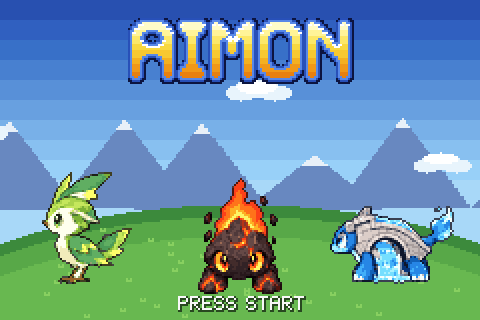 | 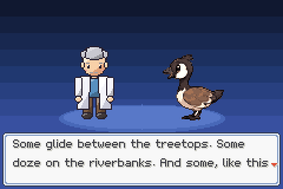 |
| 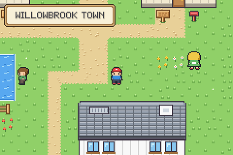 | 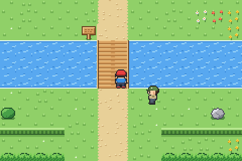 |
| 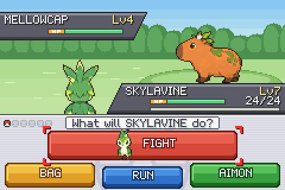 | 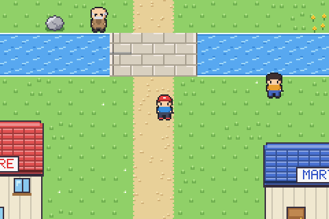 |
| 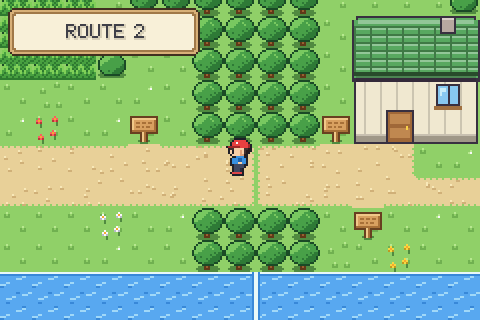 | 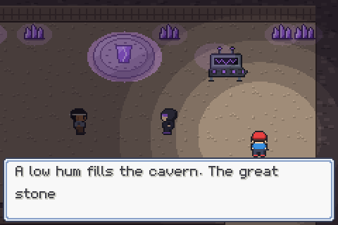 |
| 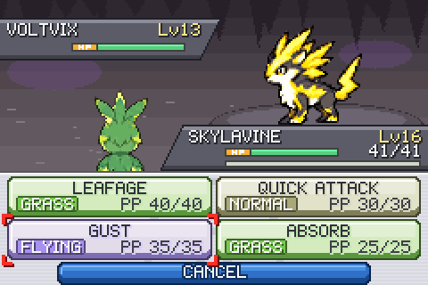 | 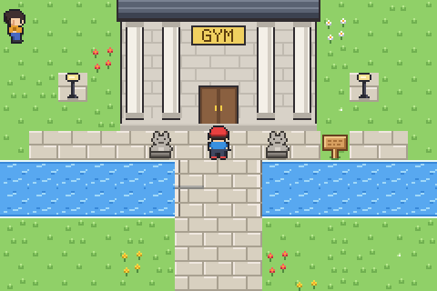 |
| 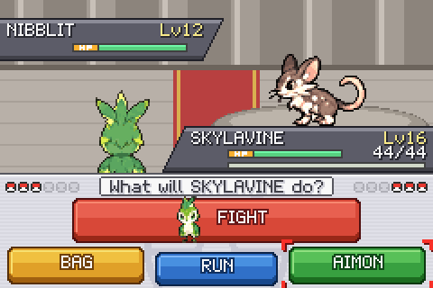 | 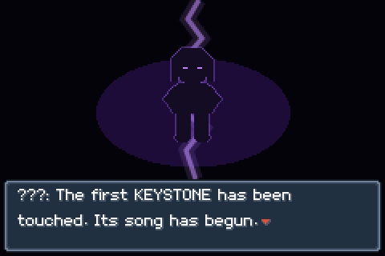 |
| 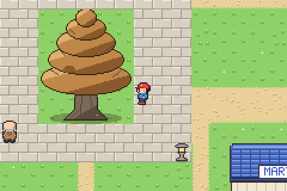 | 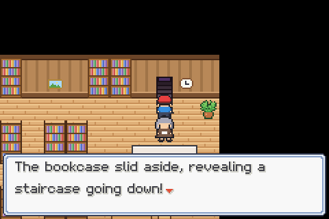 |
| 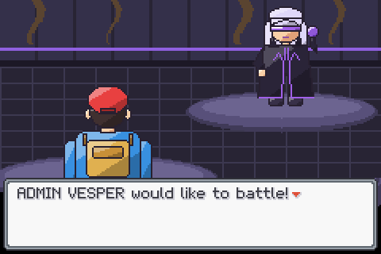 | 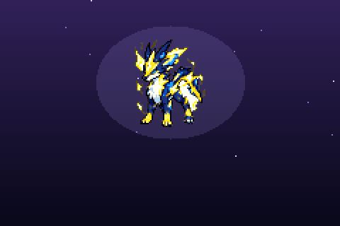 |
| 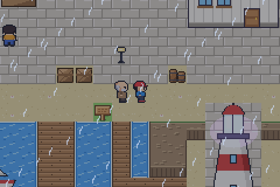 | 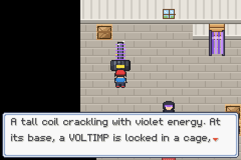 |
| 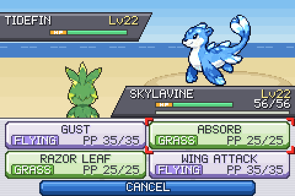 | 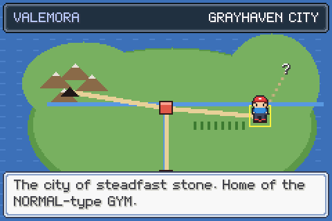 |
| 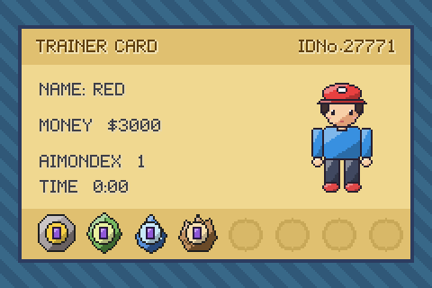 | 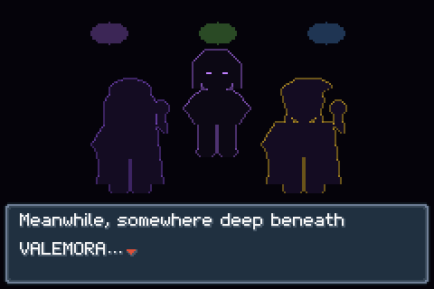 |

## Play

No build step and no dependencies. Either:

- open `index.html` in a browser, or
- serve the folder, e.g. `python3 -m http.server 8000`, then visit
  <http://localhost:8000>.

| Button | Keyboard |
|---|---|
| D-pad | Arrow keys / WASD |
| A | Z, Space |
| B | X, Esc, Backspace (hold to run) |
| START | Enter |
| Sound on/off | M |

On phones and tablets an on-screen D-pad with A/B/START/SELECT appears.
Clicking or tapping the game screen also works as A. The game saves to the
browser's local storage (START → SAVE).

To get the whole game as one self-contained HTML file (for sharing or
hosting anywhere), run `python3 tools/bundle.py`. It writes
`dist/aimon.html`.

## What's in it

**Story**

1. Title screen, then PROF. LINDEN's welcome speech. Pick a preset name or
   type your own.
2. Wake up in your bedroom. Downstairs, Mom tells you the professor is
   waiting at his lab.
3. The lab is at the south end of Willowbrook Town. Choose **SKYLAVINE**
   (Grass), **MOLTAROCK** (Fire) or **ARCHEPIN** (Water). Your neighbour and
   rival **KAI** takes the one with the type advantage, then challenges you on
   your way out.
4. PROF. LINDEN gives you the AIMONDEX and five AIMON BALLS. If you try to
   leave town before this, you're turned back from the tall grass.
5. **Route 1** runs north along a river, crossing it on the Old Willow Bridge.
   Wild **GOSKIE** and **MELLOWCAP** live in the tall grass. There are three
   trainers (one of them in your path), hidden items and one-way ledges.
6. **Archford Town** has three houses to visit (one has a gift), an **AIMON
   CENTRE** that heals for free and has a storage PC, and an **AIMON MART**.
   The road north is closed for bridge repairs.

**Chapter 2: TEAM DISTORTION** (Kai calls it "the third tremor today")

7. When you reach Archford the ground shakes and KAI runs up. He went into
   **RIFTSTONE CAVE** at the end of **Route 2** and found people in black
   coats and violet visors, **TEAM DISTORTION**, hauling a humming machine
   underground. Their VOLTVIX knocked his starter out, and HOLT, the GYM
   LEADER of Grayhaven City, went in after them alone.
8. **Route 2** runs west from Archford along the river to a mountain wall
   and the cave mouth. It has two trainers, tall grass and hidden items.
9. **Riftstone Cave** has two dark floors joined by a ladder, where only
   the area around you is lit and violet crystals glow. Wild **TERRAPIKE**
   (Ground) and **SCRAPAW** (Fighting) live here, alongside a hiker and a
   black belt, and old carvings on the walls read "EIGHT STONES. EIGHT
   WARDENS."
10. On the lower floor, a DISTORTION GRUNT has driven a machine (the
    RESONATOR) into a great carved stone while HOLT's paralysed team looks
    on. The camera pans up to the standoff, then the grunt battles you with
    his electric-type **VOLTVIX**. Beat him and he leaves with a warning:
    the stone is already cracked.
11. HOLT explains that the stone is a **KEYSTONE**. There are eight, one under
    every GYM, and together they seal the **RIFT**. He heals your team, gives
    you the **EXP. SHARE** and reopens his GYM. Until then its doors stay
    locked, with his note pinned to them.
12. **Route 3** runs east from Archford through bamboo groves, with wild
    **LEAFGRUB** (Bug/Grass) and **BAMBUCK** (Grass). KAI is waiting near
    the end of it for a rematch.
13. **Grayhaven City**, the "city of steadfast stone", has a centre, a mart
    with better stock, three houses (a historian who tells the legend of
    VALEMORA and the RIFT, and someone who gives away REPELs) and the
    **GRAYHAVEN GYM**.
14. The GYM has two trainees and a guide, then **LEADER HOLT** and his three
    Normal types: **NIBBLIT**, **DAPPLEKIT** and **RUFFANG**. Win to earn
    the **KEYSTONE BADGE** (it has a real violet sliver of the stone) and
    **TM01 SWIFT**.
15. Walk out of the GYM for a short epilogue: somewhere deep underground,
    someone else is pleased that the children are collecting BADGES.

**Chapter 3: The Withering Cedar**

16. Back in Willowbrook, the road west (blocked by rockfall until you have a
    BADGE) is open. PROF. LINDEN catches you there to explain **EVOLUTION**,
    and asks you to check on his friend IVY in Cedarwood.
17. **Route 5** is a forest road with a fishing pond. A fisherman gives you
    the **OLD ROD**. North of it lies **Pinecrest Forest**, a dark wood lit
    by stone lanterns, where **WRAITHLING** drift through the grass. At the
    old shrine in its heart waits a one-time encounter: **UMBRAFANG**, "the
    guardian of forgotten places".
18. In **Cedarwood Village** the thousand-year-old great cedar is dying from
    the roots up, and IVY's GYM is locked. KAI suspects TEAM DISTORTION.
19. IVY is in the **library**, sure that black-coated visitors vanish inside
    it every night. A torn note and a missing volume lead to a bookcase with
    a cold metal spine. Pull it, and it slides aside to reveal a hidden
    staircase. KAI charges in ahead of you.
20. **TEAM DISTORTION's hideout** is dug into the cedar's roots. There are
    grunts with new AIMON (**VOLTIMP**, **TUNER**, WRAITHLING), and a violet
    energy gate that only a **CARD KEY** will open, so you'll have to take
    one off a grunt.
21. In the **root chamber**, ADMIN **VESPER** has beaten KAI and is draining
    the **ROOTSTONE**, Cedarwood's KEYSTONE, with a RESONATOR. Beat her and
    she vanishes, saying the stone's "song" is already recorded. IVY tears
    the machine loose and the cedar begins to heal. Every GYM LEADER, it
    turns out, is the **WARDEN** of one KEYSTONE.
22. IVY's greenhouse **GYM** (LEAFGRUB and BAMBUCK) awards the **GROVE
    BADGE** and **TM02 MAGICAL LEAF**.

**Chapter 4: The Storm over Seabreeze**

23. With IVY's word, Grayhaven's guard opens **Route 4**, a rainy coastal
    road south with beaches, tide pools and fishing spots. KAI is waiting
    for a rematch.
24. **Seabreeze Port** is stuck under a storm that hasn't moved in three
    days. There's rain, lightning and thunder, the harbour is shut, and the
    lighthouse on the point is glowing violet. Captain **NERISSA**, the GYM
    LEADER, can't get in: TEAM DISTORTION has sealed the door with the same
    energy lock as the hideout. Your CARD KEY opens it, and KAI guards the
    door behind you.
25. **The lighthouse** is a climb, not a maze. Every floor's stairs are
    blocked by energy gates powered by storm coils, and each coil is run by
    a caged VOLTIMP. Free one and the panicked VOLTIMP attacks you (you can
    catch it); its coil dies, and when every coil on a floor is dead, the
    gate drops.
26. At the top, ADMIN **THANE** and his **STORMGALE** are riding the storm
    around the lamp, which is really the **TIDESTONE**. When you win, the
    CONDUCTOR calls him off by radio ("three songs are enough to hear the
    shape of the melody"). The storm breaks and the sun comes out over the
    port.
27. NERISSA's water GYM, with fully evolved **TIDEFIN**, **REEFLORD** and
    **SKYSERAPH**, awards the **TIDE BADGE** and **TM03 WATER PULSE**.
28. A second epilogue: VESPER and THANE report to the CONDUCTOR. The ferries
    to the islands aren't running yet, so that's the end for now.

**Gameplay**

- Tile-based movement with walking, running, ledge hops, doors and stairs.
  Towns and routes join up with no loading screen, and a location banner
  shows when you enter an area.
- **Battle screen in the DS style:** the choices sit on a touch-screen-like
  panel, with a big red FIGHT button (showing your AIMON's icon), BAG, RUN
  and AIMON buttons, and a row of party balls for each side. Moves are
  type-coloured buttons that show the type and PP, with a CANCEL bar
  underneath. Red corner brackets mark the selection. The HP boxes are dark
  slanted plates, and messages appear in a white box. The buttons work with
  the d-pad, or you can click or tap them.
- Battles use GBA-era formulas: stats and IVs, same-type bonus, type matchups,
  critical hits, accuracy, stat stages, priority moves, draining, recoil and
  flinching. Grass/Water starters get a power boost at low HP
  (Overgrow/Torrent).
- EXP, level-ups (with a stat-gain window), learning moves, and replacing an
  old move once four are known.
- Catching uses the GBA ball-shake formula. You can nickname what you catch,
  and extra AIMON go to the PC.
- Trainers spot you from a distance, walk up and challenge you, and pay prize
  money when beaten. If your whole team faints you "white out" back to the
  last place you healed.
- Menus: AIMONDEX (with entries adapted from the design sheets), party,
  summary pages, bag, trainer card, save and options.
- **Types:** Normal, Grass, Fire, Water, Flying, Rock, Electric, Ground,
  Fighting, Bug, Dark, Ghost and a new **Sound** type (strong against Rock
  and Ghost, weak to Ground and Dark). Immunities work as you'd expect:
  Ground ignores Electric, Flying ignores Ground, and Ghost ignores Normal
  and Fighting (and vice versa).
- **Evolution:** AIMON that level up in a battle can evolve afterwards. The
  scene flashes between the two forms, and holding B stops it. The
  evolutions: TIDEPUP → TIDEFIN (Lv 20), REEFWHIRL → REEFLORD (26), SKYDRIFT
  → SKYSERAPH (28), VOLTIMP → STORMGALE (24) and TUNER → SONARION (32).
- New moves include fixed-damage ones (SONIC BOOM, NIGHT SHADE), HEX (twice
  as strong against a statused foe), ECHOED VOICE (gets louder each turn it
  is used in a row), WILL-O-WISP and BOOMBURST. FLAMBRAMBLE's BLAZE powers
  up FIRE moves at low HP.
- **Status conditions:** paralysis (half speed, sometimes can't move), sleep
  and burn (halves physical damage and hurts each turn). Each has its own
  animation and a tag on the HP box. Electric types can't be paralysed,
  Fire types can't be burned, and powder moves don't affect Grass types.
  PARLYZ HEAL, AWAKENING, BURN HEAL and FULL HEAL cure them.
- Multi-hit moves (DOUBLE KICK), moves that never miss (SWIFT), stat moves
  that raise two stats at once (BULK UP, WORK UP), and new move animations
  for electric, ground, fighting, bug and powder moves.
- **Eight GYM BADGES:** the trainer card has eight badge slots, and each
  badge you win is shown in close-up.
- **Bag pockets:** ITEMS, BALLS, TMs and KEY ITEMS. TMs can be used again
  and again.

**Quality-of-life features**

- **RARE CANDY (test build):** there's one in the ITEMS pocket from the start,
  and it never runs out (×∞). Each one raises an AIMON's level by 1 straight
  away, with the stat window, any new moves and evolution. After each use
  the party list stays open, so you can keep pressing A to level up again.
  Older saves get one when loaded.
- **Gentler level curve:** from Route 5 on, trainers, GYM LEADERS and wild
  AIMON are 1–2 levels lower than before, and battles give 20% more EXP.
- **EXP. SHARE** (a key item you can switch on or off): AIMON that sat out a
  battle still get half the EXP.
- **Text speed** (START → OPTION): SLOW, MID or FAST. The setting is kept in
  the browser.
- **REPEL** keeps weaker wild AIMON away for 100 steps. **ESCAPE ROPE** takes
  you straight out of the cave.
- The AIMONDEX shows where each AIMON lives (including fishing spots), and
  each move button shows its type and PP.
- **Fishing:** with the OLD ROD, face any water and press A, or use it from
  the KEY ITEMS pocket. Some AIMON only live underwater.
- **Move Reminder:** an old sage in Cedarwood teaches AIMON moves they have
  forgotten, for free.
- **Weather:** rain on Route 4 and a thunderstorm over Seabreeze, both of
  which clear up for good once the storm is broken.
- Some TMs can only be taught to certain types (MAGICAL LEAF, WATER PULSE).
- **Town map** of the whole region, based on the VALEMORA map: 26 places, with
  roads and sea routes. The places you've visited are marked, and you can
  move the cursor to read about each one.
- Trainer AI avoids moves the target is immune to, and won't try to inflict
  a status the target already has or can't get.
- Map edges join seamlessly in all four directions, and rivers and paths
  line up across them.

## Project layout

```
index.html            page, canvas and touch controls
css/style.css
js/core/              game-loop helpers, coroutines, input, synth audio
js/gfx/               pixel font, tiles and buildings, overworld people,
                      trainer portraits, UI windows
js/data/              species, moves, types, items, trainers, maps, music,
                      sprite_data.js (generated)
js/game/              overworld, dialog, menus, battle, story events, screens
assets/sprites/       battle sprites and party icons (generated)
tools/make_sprites.py converts the design sheets into sprites
tools/make_townmap.py turns the region painting into the town map terrain
tools/bundle.py       inlines everything into dist/aimon.html
art/                  the design sheets and the VALEMORA region map
```

Later chapters live in their own files next to the originals: `tiles_ext.js`
and `tiles_ch3.js` (tiles, buildings and props), `maps_ch3.js` and
`events_ch3.js`. Evolution is in `evolution.js`, and the DS-style battle
panels and HP plates are in `battle_ui.js`.

Cutscenes and battles are written as generator functions (`yield* say(...)`,
`yield* OW.walk(...)`) run by a small coroutine scheduler inside the fixed
60 fps loop. All art except the AIMON is drawn in code at startup, and all
music and sound effects are synthesised with the Web Audio API.

## Regenerating the AIMON sprites

The battle sprites come from two kinds of source:

- the design PDFs, for the starters, GOSKIE and MELLOWCAP (Front/Side/Back
  turnaround panels);
- the pixel-art sheets in `art/sheets/`, for everything added in chapters
  2 and 3. Where a sheet shows only one view, the player's side uses the
  same art mirrored so it faces the opponent.

The script cuts out each view, removes the background, shrinks it to 64×64,
reduces it to 15 colours and adds a dark outline:

```
pip install pymupdf pillow numpy
python3 tools/make_sprites.py                                   # art/sheets only
python3 tools/make_sprites.py starter_mons.pdf route_1_mons.pdf # + the PDFs
```

Set `ONLY=tidepup,tidefin` to rebuild just some sprites. This rewrites
`assets/sprites/*.png` and `js/data/sprite_data.js`. The crop boxes and
sizes are at the top of the script.

The town map's terrain comes from the region painting in
`art/valemora_map.webp`. `python3 tools/make_townmap.py` sorts it into
terrain kinds, shrinks it to 240×158 and repaints it in a flat GBA palette
(`assets/sprites/region_map.png`). The game draws the roads, towns and labels
on top.

## Debug shortcuts

`index.html?debug=route1` skips the story and starts with a level 7 starter.
Other spots: `willowbrook`, `archford`, `lab`, `centre`, `mart`, `home`,
`route2`, `cave`, `route3`, `grayhaven`, `route5`, `pinecrest`, `cedarwood`,
`library`, `route4`, `seabreeze`, `lighthouse`. Add `&starter=moltarock` or
`&starter=archepin` to pick the starter.
